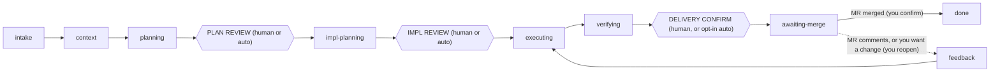

# Morpheus OS

> Agents: read [`AGENTS.md`](AGENTS.md) instead of this file — it is the
> canonical instruction set. This README is for humans.

Morpheus OS is a personal agent harness workspace: a repo registry, a
planning discipline, a knowledge base, and a set of runbooks that give any
coding agent a consistent, auditable process for working across your
repos. It works with Claude Code, GitHub Copilot, Codex, or any agent that
reads `AGENTS.md`.

## Directory map

| Path | Purpose |
| --- | --- |
| `config/` | Repo registry (`repos.yaml`) and personal preferences (`preferences.md`). |
| `repos/` | Clones of registered repos, one dir per repo id. |
| `worktrees/` | Per-task worktrees checked out from `repos/`. |
| `scripts/` | Bash automation: sync, work scaffolding, worktree management, validation. |
| `workflow/` | The work lifecycle definition and per-phase instructions. |
| `templates/` | Document shapes for work items and knowledge docs. |
| `work/` | Work items in flight (`backlog/`, `active/`, `done/`). |
| `knowledge/` | Durable knowledge base about your registered repos. |

## Workflow



There are three review gates: after the plan, after the implementation
plan, and before anything is pushed or opened as an MR/PR. A plan-review
subagent audits the first two and can auto-approve high-confidence plans
when you opt in (see How to use it); the delivery gate is yours by
default, with its own opt-in (`Auto-deliver`) for fully green runs.

## First-time setup

### Make it yours

This repo is a **template** — don't work inside a clone that still points
at the public repo. Clone it, keep the template as a push-disabled
`upstream` for updates, and make your own (ideally **private**) repo the
`origin` — your registry, preferences and knowledge base must never land
on the public template:

```
git clone <public-template-url> my-workspace
cd my-workspace
git remote rename origin upstream
git remote set-url --push upstream DISABLED
git remote add origin <your-private-repo-url>
git push -u origin main
```

The `workspace-setup` runbook does exactly this as its remotes step (say
"run the workspace-setup runbook" or `/setup` in a fresh clone), and the
`update-harness` runbook pulls later template changes in
(`/update-harness`): fetch `upstream`, show the incoming changelog
entries, merge on your confirmation, apply the action items, validate,
push to `origin`. With the push URL `DISABLED`, an accidental
`git push upstream` cannot happen.

This stays low-conflict because personal layers (`config/`, `work/`,
`knowledge/`) rarely touch harness machinery (`scripts/`, `workflow/`,
`templates/`, `AGENTS.md`).

After any upstream pull, read [`CHANGELOG.md`](CHANGELOG.md) — every
entry says what changed in behavior and whether your copy needs action.
Then run `scripts/validate.sh`: the harness declares
which knowledge-format version it supports, and the validator compares it
against your knowledge base's `okf_version` stamp — if the update moved
the format ahead of your docs, it says so and points you at the
`kb-migrate` runbook to bring them up to date.

Committing your workspace is optional and always yours to trigger —
nothing in the harness auto-commits or auto-pushes it; skipping just
costs you git's history/backup/machine-migration benefits. Your
registered code repos are unaffected either way — `repos/` and
`worktrees/` are gitignored, and their changes ship via branches + MRs to
their own remotes.

### Recommended: agent-guided setup

1. Clone your copy (see "Make it yours" above).
2. Open your coding agent in the repo root.
3. Say **"set up my workspace"**.

The agent runs the `workspace-setup` runbook, which:

- Verifies prerequisites are installed and authenticated.
- Onboards your repos via the `add-repo` runbook — registry entry, clone,
  gate-command detection, and a seeded knowledge base section per repo.
- Interviews you to fill in `config/preferences.md`.
- Smoke-tests the result with `scripts/validate.sh`.

**Prerequisites:** `git`, `bash`, a coding agent, and `glab` and/or `gh`
authenticated (`glab auth login` / `gh auth login`) for whichever host(s)
you use. Optional: `yq`, `shellcheck`.

<details>
<summary>Manual setup path</summary>

1. Hand-edit `config/repos.yaml` to add your repos.
2. Run `scripts/sync-repos.sh` to clone them under `repos/`.
3. Hand-edit `config/preferences.md` with your conventions.
4. Run `scripts/validate.sh` to smoke-test the setup.

Repos added this way start with an empty knowledge base section — the
agent has not onboarded them, so nothing has been seeded under
`knowledge/repos/<id>/`.

</details>

**Known limitations:**

- The `CLAUDE.md` and `.github/copilot-instructions.md` symlinks require
  macOS or Linux. On Windows, enable `core.symlinks` in git or the files
  will check out as broken links.
- Server-side GitHub Copilot features may not follow symlinks; if Copilot
  doesn't pick up `AGENTS.md` via the symlink, point it at the file
  directly.

## How to use it

Start work by scaffolding a work item, or just tell the agent what you
want done and let it scaffold for you:

```
scripts/new-work.sh task|story|epic "<title>"
```

| Phase | What happens | What you're asked |
| --- | --- | --- |
| intake | Work item is scaffolded and framed. | — |
| context | Agent reads the relevant repo(s) and knowledge base. | — |
| planning | Agent drafts a plan. | — |
| plan-review | A plan-review subagent audits the plan (assumptions, doubts, missing context) and scores its confidence. | **Approve or revise the plan** — or nothing, if you've enabled auto-approval and the score clears your threshold. |
| impl-planning | Agent breaks the plan into an implementation plan. | — |
| impl-review | Same subagent review as plan-review, against the implementation plan. | **Approve or revise the implementation plan** — same optional auto-approval. |
| executing | Agent delegates implementation to subagents in worktrees. | — |
| verifying | Agent runs verification commands. | — |
| delivering | Learnings are harvested to the KB; worktrees are removed. | **Confirm before push / MR / PR** — unless you've enabled `Auto-deliver` and the run is fully green (verification + diff review PASS). |
| awaiting-merge | The MR/PR is open. The session brief reports its live state (merged, comments, changes requested); `scripts/mr-check.sh` does the same on demand. | **Say when to close** ("close `<work-id>`") once it's merged, or reopen it (`feedback`) if reviewers or you want changes. |
| done | The MR is merged and the work item is closed. | — |

Review gates 1–2 can approve automatically: set an auto-approve threshold in
`config/preferences.md` (off by default) and plans whose review confidence
clears it proceed without waiting for you. Hard caps always override —
plans with open questions for you, destructive steps, or security-touching
scope come to you regardless of score (see `workflow/plan-reviewer.md`).
Every auto-approval is recorded in the doc (`approved_by:`) and the task's
Activity log, and you can veto one after the fact by setting the doc to
`changes-requested`.

The delivery gate has its own opt-in: set `Auto-deliver: on` in
`config/preferences.md` and a fully green run — every quality gate green
in the verification report AND a PASS diff review — pushes and opens its
MR without waiting for you (carried MINOR diff-review findings move into
the MR description). Anything less still stops for you, and every
auto-delivery lands in the task's Activity log.

Other things you can do:

- **Check your MRs:** say "check MRs" (or `/mr-check`) — every item
  awaiting merge is looked up on its host and reported as merged, open,
  needing attention, or closed without merge. The session brief does this
  automatically at start; pass `--no-mr-check` to skip it when offline.
- **Address MR feedback, or change your mind:** say "address the feedback
  on `<work-id>`" or "on `<work-id>`, also change X" — the item awaiting
  merge reopens (`feedback` status), its worktree comes back on the same
  branch, review comments and your request are triaged into plan steps,
  and the same gates apply on the way back out: same branch, same MR,
  replies posted on the threads. Only items not yet merged can be
  reopened; after the merge, new changes are a new work item.
- **Close on merge:** say "`<work-id>` was merged" or `/close <work-id>` —
  the agent confirms the merge on the host, deletes the local task branch,
  and moves the item to `work/done/`.
- **Run a runbook:** "run the `<name>` runbook."
- **Ad-hoc ops:** ask the agent to run a one-off shell or MCP operation.
- **Ask questions:** the knowledge base can answer "how does repo X work?"
  without starting a work item.
- **Work in parallel:** every task executes in its own worktree, so
  multiple tasks are safe to run at once. List them with
  `scripts/worktree.sh list`.

## How to maintain it

**Weekly-ish:**

- Run `scripts/validate.sh`.
- Run the `kb-review` runbook.
- Prune finished items out of `work/done/`.

**Adding a repo:** tell the agent "add repo `<url>`", or do it manually
(see Manual setup path above).

**Removing a repo:** reverse the add — drop its `config/repos.yaml` entry
and its `repos/<id>` clone; optionally keep its `knowledge/repos/<id>/`
section for future reference.

**Where are we?** `scripts/status.sh` — a token-free dashboard: work items
by state (flagging gates waiting on you and blocked items), worktrees
(flagging orphans), repo clone state, and validation warnings.

**What should I pick up?** `scripts/session-brief.sh` — a shorter,
read-only brief: open work items (gates waiting on you, blocked, in
progress, backlog), knowledge docs due for maintenance (past
`stale_after`, drafts older than 30 days, agent-authored docs never
human-verified) and an ordered priority list — or a plain "nothing to
pick up". It runs automatically at every session start and resume through
project-scoped hooks — `.claude/settings.json` for Claude Code and
`.github/hooks/session-brief.json` for Copilot CLI — so nothing is
installed at user level. `--hook claude` / `--hook copilot` emit each
client's session-start JSON; other agents can wire the plain-text output
into their own session-start mechanism.

**Which harness version am I on?** `VERSION` at the root, shown as
`Harness: <version>+<commit>` on the second line of every session brief,
with a `Harness update available` line when upstream has moved.

**How is the harness doing?** Every work item carries a run record — a
version stamp, a structured `events.log` (written by `scripts/event.sh`
together with the prose Activity line), and a `trace/` folder with every
subagent brief, the implementer's reports and, on Claude Code and Copilot
CLI, pointers to and copies of the raw transcripts (`trace/raw/` is
gitignored). `scripts/scorecard.sh --summary` (or `/scorecard`) aggregates
them per harness version: gate rounds and confidences, auto-approval rate,
changes requested, blocked items, human corrections, reverts, items with
gate gaps, lead time. That table is how a harness change is evaluated.

**Feeding the proposer:** `scripts/export-experience.sh --dest <store>` (or
`/export-experience`) copies the run record of finished items — docs, events
log, traces, the session transcripts they point at — plus scorecard snapshots
into an experience store outside the workspace, after a secrets sweep. The
store is read by a separate proposer repo that suggests harness changes as
pull requests; see `knowledge/decisions/proposer-loop-separate-repo.md`.

**Housekeeping:** run `scripts/status.sh` periodically (it subsumes
`worktree.sh list` and the validation sweep), and keep
`config/preferences.md` current as your conventions change.

**Sharing knowledge bundles:** the knowledge base speaks
[OKF](https://github.com/GoogleCloudPlatform/knowledge-catalog) — a
knowledge bundle is just a directory of markdown concepts, so knowledge
moves in both directions:

- *Import:* "import bundle `<url>`" registers an external bundle in
  `config/bundles.yaml` and vendors it read-only under
  `knowledge/bundles/<name>/` (gitignored; `scripts/sync-bundles.sh`
  re-syncs it). Your agent navigates it like native knowledge.
- *Export:* "share my `<repo-id>` notes" runs the `share-bundle` runbook —
  it copies the subtree to a standalone repo, rebases links, stamps
  `okf_version`, checks conformance and sweeps for private material before
  you push it anywhere.

**Evolving the harness** — customize from the most specific layer down:

| Layer | Governs |
| --- | --- |
| `config/preferences.md` | Your personal conventions. |
| `config/repos.yaml` | Registered repos and their gate commands. |
| `templates/` | The shape of work-item and knowledge documents. |
| `workflow/phases/` | Process behavior at each phase. |
| `AGENTS.md` | Hard rules that apply everywhere. |

**Migrating machines:** clone this repo, then run `scripts/sync-repos.sh`
to re-clone your registered repos.
